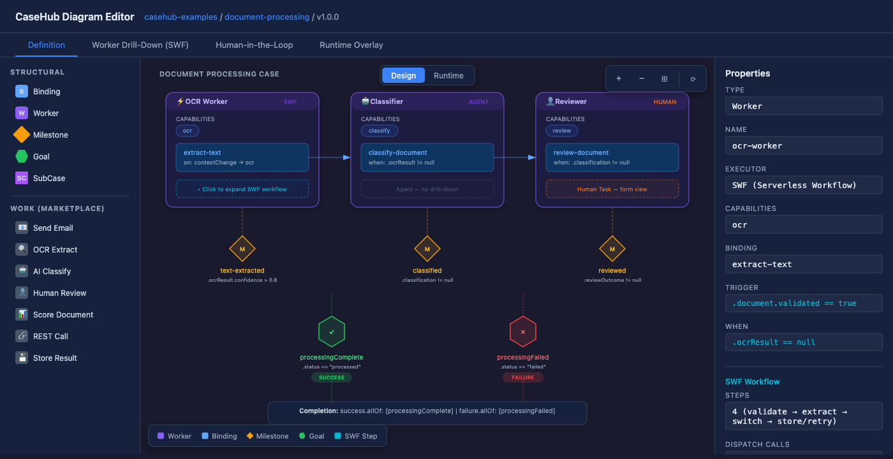
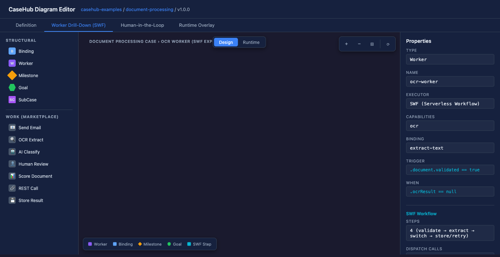
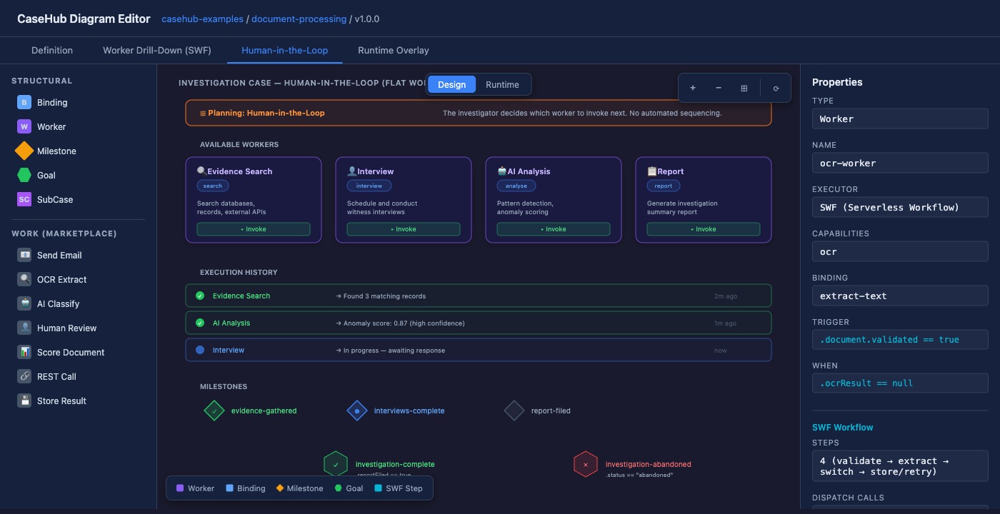
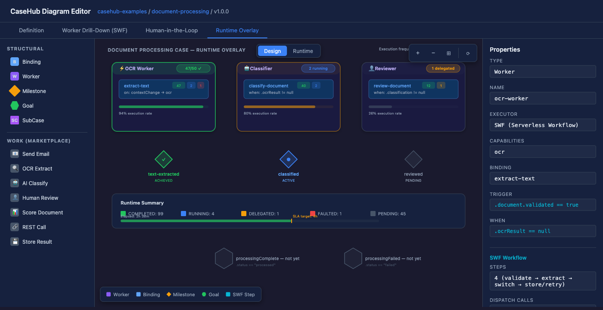

# Seeing Cases: Building a Visual Editor for Adaptive Case Management

Case definitions are text. YAML, specifically — six workers, twelve bindings, three milestone conditions, goal expressions wired through capability dispatch. It works. It diffs in git. It round-trips through Jackson.

But nobody can look at a YAML file with that much wiring and quickly understand the flow. Where does control go when a document is validated? Which worker handles the OCR capability? What are the milestone conditions gating? The information is there — the topology is not.

We need a visual editor. Not a whiteboard. Not a diagram generator. An editor that reads YAML, renders the structure as a directed graph with auto-layout, and writes YAML back. The definition is always YAML — the visual representation is a view over it, not a replacement for it.

## The problem is harder than it looks

A case definition is not a flowchart. It's not even a workflow in the Serverless Workflow sense, where you have a linear sequence of tasks with branches and joins. A case is a choreography — bindings declare reactive triggers that dispatch to workers based on capabilities. Workers don't execute in a predetermined sequence; they fire when conditions are met. Milestones observe progress without controlling it. Goals define terminal outcomes. Sub-cases compose recursively.

The visual language has to capture all of this without flattening it into something it isn't.

And that's before the hybrid display requirement. CaseHub executes multiple model types: cases, Serverless Workflows, HTN-style planning decompositions through compound plan items, rule sets, AI agents. A single case definition can embed a Serverless Workflow inside a worker — the worker's `do:` block is a full SWF workflow that runs when the binding's trigger fires. The visual editor needs to show that. Click on a worker, drill into its embedded workflow, see the SWF steps on the same canvas with the same rendering engine.

This isn't a nice-to-have. If you can see the case but not the workflow inside it, you're back to switching between tools. If you can see the workflow but not the case around it, you've lost the orchestration context. The value is in the composite view.

## What to render: definition, not execution

Here's where the first critical design decision lives. CaseHub has two distinct models operating on the same definitions:

**The definition model** — what the author writes in YAML. Bindings, workers, milestones, goals, capabilities. Flat lists of peer-level elements connected by string references.

**The planning model** — what the engine produces at runtime. Compound and Primitive PlanItemDefinitions, decomposition strategies, completion semantics, a blackboard with an agenda queue. This is the engine's internal execution model.

The visual editor works on the definition model. Not the planning model. This distinction matters because the two have different topologies. The YAML defines a choreography: bindings react to triggers and dispatch to workers by capability name. The planning model decomposes that into a hierarchical task network with compound/primitive containment. They're related, but the definition-time view should mirror what the author wrote, not what the engine will internally decompose it into.

We'll add a runtime overlay later — projecting execution state (TaskStatus badges, milestone progression, heatmaps) onto the definition graph. But the structural graph is the definition. Always.



## The stencil architecture

Every visual modelling tool has a vocabulary — the set of shapes, connection types, and rules that define what you can draw. BPMN has tasks, gateways, events, pools. UML has classes, interfaces, associations. The wrong vocabulary forces users to think in the tool's terms instead of their own.

CaseHub's visual vocabulary is driven by two independent concerns that need separate treatment.

**Structural stencils** define the graph grammar — what the graph is made of. These are compile-time, fixed per domain:

| Stencil | Shape | What it represents |
|---------|-------|-------------------|
| Binding | Rounded rectangle | A reactive dispatch rule — trigger → capability |
| Worker | Container rectangle | A capability provider — may contain an embedded SWF |
| Milestone | Diamond | An observable progress marker — achieved when its condition becomes true |
| Goal | Hexagon | A terminal outcome — success or failure, gates case completion |
| SubCase | Nested container | A child case definition, composed recursively |

Each stencil carries containment rules (Workers contain Bindings), connection rules (Goals have no outgoing edges), and a property schema (JSON Schema, reusing the CaseDefinition's `$defs` directly — no separate schema to maintain).

**Work stencils** are a different animal entirely. These define the leaf vocabulary — what a Primitive node actually *does*. Send an email. Run an AI agent. Call an external API. Submit a human task. These aren't part of the graph grammar; they're runtime-discoverable from marketplace YAML at configurable URLs.

A marketplace descriptor looks like this:

```yaml
name: send-email
displayName: Send Email
category: connectors/messaging
icon: mail
async: true
properties:
  to: { type: string, required: true }
  subject: { type: string, required: true }
  template: { type: string, format: rich-text }
input:  { type: object }
output: { type: object }
```

The editor discovers these at startup, groups them by category in the palette, and lets you assign them to workers. The stencil defines the icon, the property form, the I/O contract. It does not contain executable code — that's a deliberate security boundary. The rendering is handled by the graph engine using the declarative metadata.

This separation means the editor ships with a fixed understanding of what a case *is* (structural stencils), but an open-ended understanding of what a case can *do* (work stencils). Add a new connector type? Publish a YAML descriptor to a marketplace URL. No editor rebuild needed.

## The hybrid display: Cases, Workflows, and Planning

The most interesting visual challenge is the hybrid display. A case doesn't exist in isolation — it orchestrates multiple execution models.

Consider a document processing case. It has workers for OCR, classification, and review. The OCR worker contains a Serverless Workflow — a sequence of HTTP calls, a conditional branch, error handling. The review worker dispatches to a human task. The classification worker runs an AI agent.

In the definition view, you see the case topology: bindings wiring triggers to capabilities, workers owning those capabilities, milestones tracking progress. Click on the OCR worker — it expands to show the embedded SWF workflow rendered with SWF-specific stencils (call, switch, raise, catch). Same canvas, same rendering engine, different stencil set for the drill-down.



The `@openworkflowspec/sdk` handles SWF YAML parsing and graph construction. We don't write our own SWF parser — the SDK produces a `FlatGraph` with nodes, edges, and containment, and our domain adapter maps it to the graph model. When the SWF spec evolves, the SDK updates, and the drill-down view picks up changes without us maintaining parsing logic.

The key insight is that these aren't separate visual models that need overlaying. They're a containment hierarchy:

```
Case (definition view)
├── Workers (containers)
│   ├── SWF Worker → drill-down to workflow steps
│   ├── Agent Worker → shows agent config
│   └── External Worker → capability reference only
├── Bindings (dispatch wiring)
├── Milestones (progress markers)
├── Goals (terminal outcomes)
└── SubCases (recursive composition)
```

One rendering engine, one graph model, pluggable stencil sets per domain. The SWF team uses the same rendering framework for their standalone editor. When CaseHub drills into an embedded workflow, it's the same library at both levels — same interaction model, same performance characteristics, shared knowledge across teams.



## The runtime overlay

The second mode isn't a separate view — it's a decoration layer over the same definition graph. Toggle it on, and every binding node gets a status badge from the engine's runtime state.

CaseHub's `TaskStatus` has nine states: PENDING, RUNNING, DELEGATED, COMPLETED, FAULTED, REJECTED, OBSOLETE, CANCELLED, SUSPENDED. Each gets a distinct visual treatment — a green pulse for RUNNING, a checkmark for COMPLETED, red for FAULTED. Milestones carry their own lifecycle: PENDING, ACTIVE, COMPLETED, FAILED, CANCELLED.

The interesting part is the aggregation problem. One binding can produce multiple PlanItems at runtime — a `validate-document` binding might fire three times for three documents. The overlay badge shows the aggregate: if two are COMPLETED and one is RUNNING, the binding shows RUNNING with a "2/3" indicator. The engine's existing `PushSource` abstraction pushes state updates to the browser via SSE — the overlay subscribes like any other blocks-ui data source.

Layering on heatmaps is where it gets useful for operations. Colour-code bindings by execution frequency over a time window. Cold paths are grey. Hot paths are vivid. Now you can see where the work concentrates, which bindings fire constantly, which milestones take the longest to achieve. Same graph, same layout, different data lens.



## Technology: React Flow in a Lit world

CaseHub's entire frontend is Lit 3.x Web Components — Pages (the component framework), blocks-ui (the domain components), and a design token system built on OKLCH colour scales. There is no React anywhere in the stack.

The visual editor needs React Flow.

I evaluated every alternative worth evaluating. Cytoscape.js is the strongest open-source graph library, but it has no public API for custom canvas-drawn node shapes — the rendering system is closed, with a styling API, not a drawing API. For a stencil-driven editor where each work type has its own visual identity, that's a dead end. GoJS and JointJS+ are purpose-built for diagram editors, but both require commercial licences ($3,400–$4,000 per developer). JointJS open-source is MPL 2.0. None qualify under our licensing requirements (MIT, BSD, Apache only).

I looked hard at the xyflow headless core (`@xyflow/system`), hoping to build a native Lit binding without the React dependency. The numbers were sobering. The core is 6,500 lines — 25% of the total codebase. The React binding is 11,700 lines. The Svelte binding, built by the xyflow team who wrote the internals, is 7,700 lines. Building `@xyflow/lit` means 6–8 person-weeks of framework plumbing, reverse-engineering undocumented internal APIs.

The pragmatic answer: bridge React Flow into a Lit component. Skip Shadow DOM on the canvas component (React Flow relies on document-level event handlers and portal-based controls that are incompatible with Shadow DOM encapsulation). Mount via `ReactDOM.createRoot` in `connectedCallback`. CSS isolation via `all: initial` plus cascade `@layer` prevents style leakage in both directions.

The bridge is roughly fifty lines of code and 45KB of bundle overhead for React and ReactDOM. The palette, properties panel, and toolbar remain native Lit components with their own shadow roots — only the canvas is React. The SWF team and CaseHub end up on the same rendering framework, which is the real strategic value: shared knowledge, same mental model for graph editing, and when CaseHub drills into a SWF workflow, it's the same library at every level.

A native `@xyflow/lit` binding remains a future option. The graph model, stencils, and domain adapters are framework-agnostic — swapping the renderer doesn't touch them.

## YAML in, YAML out

The editor reads and writes YAML. There is no intermediate JSON graph model, no database, no proprietary format. The YAML is the source of truth.

This creates a specific technical requirement: round-trip fidelity. When you edit one property on one binding, only that property should change in the YAML. Comments, formatting, quoting style, key ordering — everything untouched must remain untouched. The `yaml` npm package (v2+) handles this through a Concrete Syntax Tree that preserves the original document structure. Parse with `parseDocument()`, mutate nodes in-place, emit with `toString()`. The sections you didn't touch come back byte-identical.

Persistence is pluggable — a simple SPI that reads and writes YAML strings:

```typescript
interface PersistenceBackend {
  read(uri: string): Promise<PersistenceResult>;
  write(uri: string, content: string, expectedVersion: string): Promise<WriteResult>;
}
```

Backends can be git (read/write at a GitHub URL), the local filesystem via Electron, a REST API, or an in-memory playground for experiments. The editor doesn't know or care where the YAML lives. Optimistic concurrency prevents lost writes when two sessions edit the same file.

## The architecture

The package structure splits cleanly between foundation (domain-agnostic, in Pages) and domain (CaseHub-specific, in blocks-ui):

**Pages** provides the graph infrastructure:
- `graph-core` — the graph model, stencil registry, constraint validation engine, persistence SPI, edit operations
- `graph-renderer` — React Flow bridge, ELK hierarchical auto-layout, stencil-to-node mapping
- `graph-work-registry` — marketplace YAML loader, work stencil discovery, category indexing

**blocks-ui** provides the CaseHub domain layer:
- `graph-stencil-case` — Case domain adapter (YAML ↔ graph), structural stencils, runtime overlay adapter
- `graph-stencil-swf` — SWF domain adapter (via `@openworkflowspec/sdk`), workflow step stencils, drill-down
- `casehub-diagram` — the assembled Lit component: canvas, palette, properties panel, toolbar

This means the graph infrastructure is reusable beyond CaseHub. Any project that needs a stencil-driven graph editor on a Lit stack can use `graph-core` + `graph-renderer` + `graph-work-registry` with their own stencil sets. The SWF team could adopt the same foundation for their standalone editor.

## What's next

The foundation is bootstrapped — core TypeScript interfaces written, package structure created, epics and issues filed across repos. The immediate work is validation: verifying the CaseDefinition JSON Schema against the current Java domain model, testing YAML round-trip fidelity between the npm parser and Jackson, and spiking the React Flow + Lit bridge against Pages' CSS environment.

Then the interesting part: making it render a real case. Taking a YAML definition with workers, bindings, milestones, and goals, running it through the domain adapter, laying it out with ELK, and seeing the topology for the first time as a graph instead of text.

The progression from there is deliberate: read-only viewer first, then property editing, then structural editing (add, remove, replace nodes with auto-layout recalculation), then SWF drill-down, then work stencil marketplace, then runtime overlay. Free-form drag-and-drop is explicitly deferred — auto-layout and structural editing come first, because the model is the source of truth, not the visual positions.
