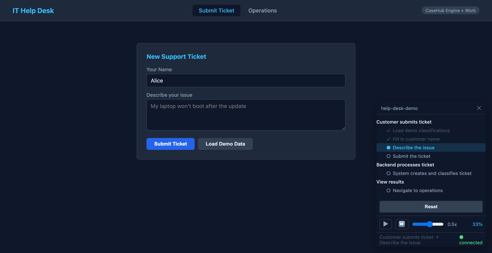

Continuing the [scenario engine series](2026-08-21-mdp02-scenario-controller-ui.md).

# The Demo That Drives Itself — Browser Automation, Distributed Executors, and a Floating Controller

The scenario engine had all the plumbing — orchestrator, push wire protocol, executor dispatch, controller UI — but nobody had ever seen it drive a real application. The helpdesk example had a form, an operations dashboard, a case engine underneath. The scenario engine could create tickets through backend actions. What it couldn't do was fill in the form, click Submit, and navigate to the results page. Two different worlds: the browser and the backend, controlled by one YAML file.

That changed today.

## Two Executors, One Scenario

The key insight behind the distributed executor architecture is that a scenario step doesn't care where it runs. A step has a `target` — the name of the executor that handles it. The orchestrator dispatches each step to the right executor via the push wire WebSocket. The executor runs the step's commands, sends back a result, and the orchestrator advances.

The browser executor handles ARIA commands: `click`, `fill`, `navigate`, `wait`. It finds elements by role and accessible name — `{role: textbox, name: "Your name"}` — then performs the action. No CSS selectors, no fragile DOM paths. If the element has an ARIA label, the executor can target it.

The helpdesk executor handles domain actions: `create-ticket`, `verify-ticket-exists`, `resolve-ticket`. These are `@ScenarioAction`-annotated methods on a CDI bean — the executor library scans them at startup and dispatches by action name.

A single scenario YAML mixes both:

```yaml
scenario: help-desk-demo
speed: 0.5

sections:
  - label: "Customer submits ticket"
    steps:
      - label: "Load demo classifications"
        target: browser
        commands:
          - action: click
            target: {role: button, name: Load demo classification data}

      - label: "Fill in customer name"
        target: browser
        trigger: {after: load-demo-data, delay: 500}
        commands:
          - action: fill
            target: {role: textbox, name: Your name}
            value: "Alice"

      - label: "Submit the ticket"
        target: browser
        trigger: {after: fill-issue, delay: 500}
        commands:
          - action: click
            target: {role: button, name: Submit ticket}

  - label: "Backend processes ticket"
    steps:
      - label: "System creates and classifies ticket"
        target: helpdesk
        trigger: {after: submit-ticket, delay: 1000}
        commands:
          - action: verify-ticket-exists
            await:
              match: {status: TRIAGED, category: HARDWARE}
```

The browser fills the form. The backend verifies the result. One file, two execution environments, connected by the push wire.

## Triggers and the Dispatch Bug

The scenario format supports triggers — `{after: step-name, delay: 500}` — that gate when a step dispatches. Step 2 doesn't fire until step 1 completes. This matters because browser steps and backend steps have different timing: a form fill is instant, but ticket classification involves the case engine, work item routing, and a keyword classifier.

I found a significant bug here. The orchestrator was dispatching ALL steps upfront as batched sequences — one per target executor — completely ignoring triggers. The `SequencePartitioner` grouped consecutive same-target steps into sequences, and `dispatchAllSequences()` sent them all on start.

The consequence was subtle and confusing. The helpdesk executor received its `verify-ticket-exists` step immediately at scenario start, before any ticket existed. It failed (no matching ticket), but the orchestrator still recorded it as "completed" in its step counter. The state tracking used `completedSteps.size()` as an index into the ordered step list — so a step completing out of order corrupted the entire progress display. The controller showed step 2 as current when step 1 hadn't executed. Steps reported success that never happened on screen.

The fix was two changes. `SequencePartitioner.partitionInitial()` now filters out steps that have triggers — only untriggered steps dispatch at start. And `ScenarioOrchestrator.onStepResult()` evaluates triggers after each completion, dispatching the next step only when its prerequisite is done. Triggered steps with delays use virtual threads to schedule the dispatch.

After the fix, the console showed exactly what I wanted to see:

```
dispatch received: 1 steps, paused: true
  step[0]: load-demo-data [click(Load demo classification data)]
```

One step. Not four. The rest fire as the scenario progresses.

## The Compact Controller Overlay

The controller UI from the previous session was a standalone full-page layout — good for a separate device, wrong for embedding in the app being demonstrated. I wanted it floating in the corner of the helpdesk UI: a small pill showing the scenario name and progress, expandable to the full outline and transport controls.



The pill collapses to `▶ help-desk-demo 33%` — minimal footprint during automated playback. Click it and the card expands: outline tree with checkmarks on completed steps, blue highlight on the current step, transport controls (play/pause/step/speed slider), and a Reset button. The glassmorphic dark card with `backdrop-filter: blur` matches the helpdesk's dark theme without clashing.

The `mode` property on the Lit component drives this — `full` for the standalone remote page, `compact` for embedding. Both use the same `ScenarioConnectionController` underneath. The overlay is draggable via pointer events on the header bar.

## Presenter Mode

The scenario starts paused when you click Start Demo. Nothing moves until you press step (⏩). Each press advances one step: the browser executor fills one field, or clicks one button, or the backend verifies one ticket. The audience watches the app being automated while the presenter controls the pace.

This is where the trigger-aware dispatch pays off. Without it, all steps would queue in the executor and advance internally — the step button on the controller wouldn't map to individual visible actions. With lazy dispatch, each step button press fires exactly one step, sends the result, triggers the next dispatch, and pauses again. The outline highlights advance in lockstep with what's happening on screen.

The Reset button calls a Flyway clean + migrate on the H2 in-memory database, stops the scenario, and reloads the page. One click back to a fresh state — the demo is infinitely repeatable.

## The Handler Chain

One piece of infrastructure made the distributed executors possible without modifying the push endpoint: the `PushRequestHandler` SPI.

Previously, the helpdesk's push endpoint had hardcoded `switch` cases for `executor-register` and `step-result`, directly calling the `ScenarioOrchestrator`. Any new app that wanted scenario support would have to duplicate that routing.

The handler chain is a simple interface in the push module:

```java
public interface PushRequestHandler {
    boolean handles(PushRequest request);
    void handle(String connectionId, PushRequest request);
}
```

The push endpoint now iterates `Instance<PushRequestHandler>` for any op it doesn't handle natively. `ScenarioPushHandler` in `scenario-runtime` implements it for executor-register and step-result. Drop scenario-runtime on the classpath and the routing auto-discovers via CDI. The endpoint only handles `listen`/`unlisten` directly — everything else goes through the chain.

## What's Next

The browser executor works but gives no visual feedback — fields fill silently, buttons click without animation. For a live demo, you want to see a focus ring on the field being filled, a pulse on the button being clicked. That's the next piece: visual feedback for automated interactions. Also on the list: a YAML fly-out panel in the controller that shows the scenario source with syntax highlighting and current-position tracking, so the audience can see both the automation and the script driving it.
